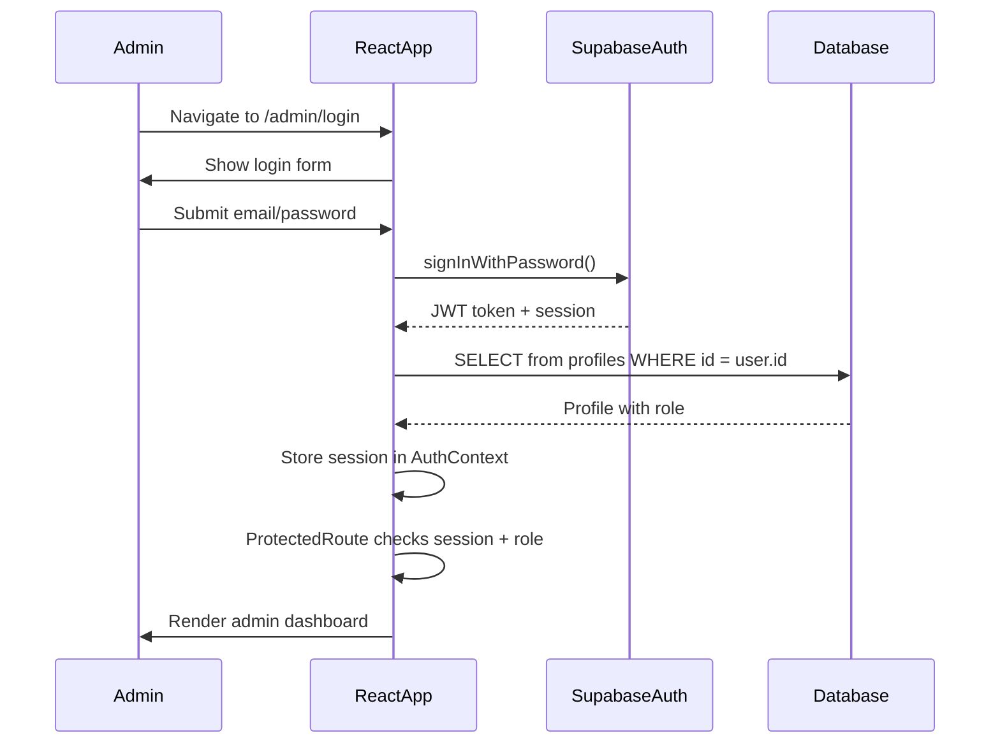

# AUTHENTICATION-AND-SECURITY.md — Fiesta Agency

## Authentication Flow

---

## Role System

| Role | Access |
|------|--------|
| `admin` | Full access to all admin features |
| `staff` | Access to admin features (limited in some areas) |

Roles are stored in `profiles.role` and also in the JWT `app_metadata.role`.

---

## ProtectedRoute

The `ProtectedRoute` component (`src/components/admin/ProtectedRoute.tsx`) guards admin routes:

1. Checks if session exists
2. Checks if profile is loaded
3. Checks if role is `admin` or `staff`
4. Shows loading spinner while checking
5. Redirects to `/admin/login` if unauthorized

---

## RLS Policies

Row Level Security is the primary access control mechanism:

| Table | Public Read | Public Write | Staff Write |
|-------|-----------|-------------|-------------|
| `pages` | Published only | No | Yes |
| `sections` | Published only | No | Yes |
| `services` | Published only | No | Yes |
| `events` | Published only | No | Yes |
| `portfolio_projects` | Published only | No | Yes |
| `testimonials` | Published only | No | Yes |
| `faqs` | Published only | No | Yes |
| `bookings` | No | INSERT only | Yes |
| `media` | All | No | Yes |
| `site_settings` | All | No | Yes |
| `profiles` | Own + staff | No | Own update only |

---

## HTML Sanitization

All `dangerouslySetInnerHTML` usage is sanitized via DOMPurify:

- `src/components/public/BlocksSectionRenderer.tsx` — Public block renderer
- `src/components/admin/pages/blocks/BlockRenderer.tsx` — Admin block renderer

The sanitizer allows safe HTML tags (p, br, strong, em, h1-h6, ul, ol, li, a, span, div, blockquote, table, img, pre, code, hr) and safe attributes (href, target, rel, src, alt, width, height, class, style).

---

## Environment Variables

The frontend only accesses `VITE_`-prefixed environment variables, which are safe to expose:
- `VITE_SUPABASE_URL` — Supabase project URL
- `VITE_SUPABASE_ANON_KEY` — Supabase anon/public key

The anon key is designed to be public. Its permissions are controlled by RLS.

---

## What the Frontend Can Safely Expose

| Safe to Expose | Never Expose |
|---------------|-------------|
| Supabase URL | Service-role key |
| Supabase anon key | Database passwords |
| Public page content | JWT secret |
| Published section content | API keys (except Web3Forms) |
| Media public URLs | Private storage tokens |

---

## Web3Forms

The contact form uses Web3Forms for email delivery. The API key is included in the frontend code, which is expected — Web3Forms is a public form service that doesn't require authentication for submissions.

---

## See Also

- [SECURITY.md](./SECURITY.md)
- [SUPABASE-DOCUMENTATION.md](./SUPABASE-DOCUMENTATION.md)
- [DATABASE-DOCUMENTATION.md](./DATABASE-DOCUMENTATION.md)
