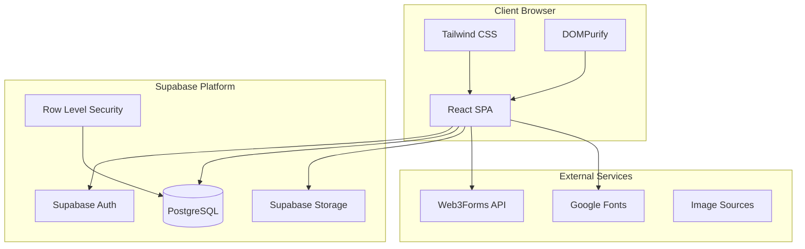
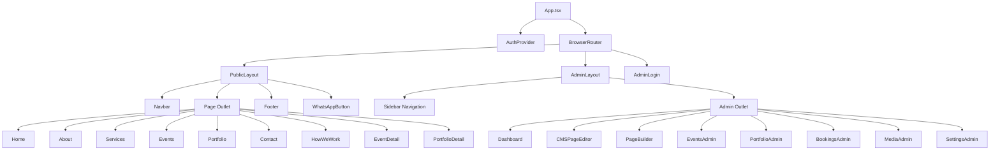
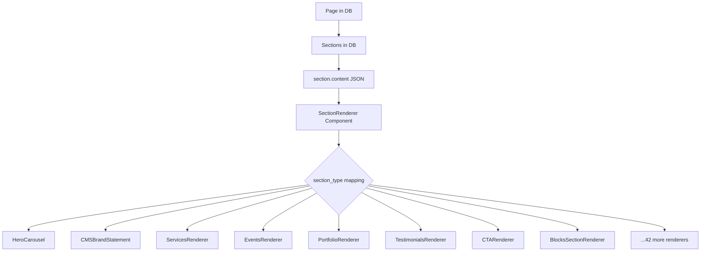
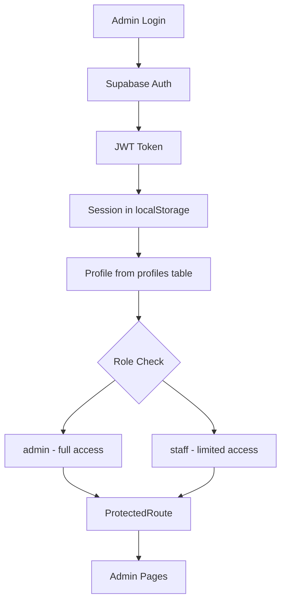
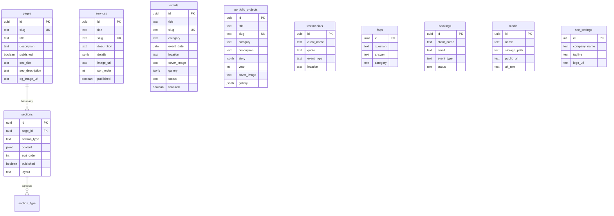
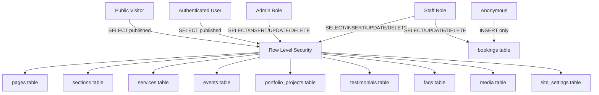

# SYSTEM-ARCHITECTURE.md — Fiesta Agency

## High-Level Architecture

---

## Component Architecture

---

## CMS Architecture

---

## Authentication Architecture

---

## Database Architecture

---

## Security Architecture

---

## See Also

- [TECHNICAL-ARCHITECTURE.md](./TECHNICAL-ARCHITECTURE.md)
- [DATABASE-DOCUMENTATION.md](./DATABASE-DOCUMENTATION.md)
- [AUTHENTICATION-AND-SECURITY.md](./AUTHENTICATION-AND-SECURITY.md)
