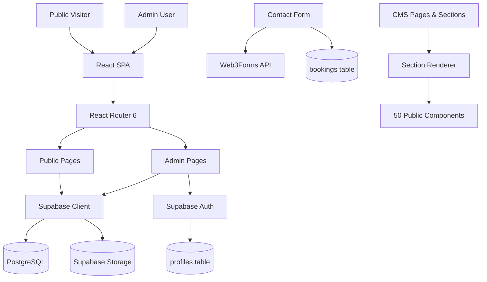

# TECHNICAL-ARCHITECTURE.md — Fiesta Agency

## Architecture Overview

Fiesta Agency is a single-page application (SPA) built with React that communicates with a Supabase backend for authentication, database, and file storage.



---

## Technology Stack

| Layer | Technology | Version | Purpose |
|-------|-----------|---------|---------|
| UI Framework | React | 18.3.1 | Component architecture |
| Language | TypeScript | 5.6.3 | Type safety |
| Build Tool | Vite | 5.4.2 | Development server, bundling |
| Routing | React Router | 6.30.6 | Client-side routing |
| Styling | Tailwind CSS | 3.4.1 | Utility-first CSS |
| Icons | Lucide React | 0.446.0 | Icon library |
| Backend | Supabase | 2.57.4 | Auth, database, storage |
| Forms | Web3Forms | — | Form-to-email delivery |
| Sanitization | DOMPurify | latest | HTML sanitization |

---

## Data Flow

### Public Page Load
```
1. React Router matches URL → lazy-loads page component
2. Page component calls Supabase to fetch page data
3. Page component calls Supabase to fetch sections
4. Sections passed to SectionRenderer
5. SectionRenderer maps section_type → component
6. Component renders with section.content as props
7. useDocumentMeta sets title, description, OG tags, canonical URL
```

### Admin Content Edit
```
1. Admin navigates to PageBuilder
2. PageBuilder loads page + sections from Supabase
3. Admin edits section content via SectionEditor
4. Changes saved to Supabase sections table
5. Public page reflects changes on next load
```

### Contact Form Submission
```
1. Visitor fills out contact form
2. Form validates client-side
3. POST to Web3Forms API → sends email
4. Fire-and-forget: insert into Supabase bookings table
5. Success/error state displayed to visitor
```

### Authentication Flow
```
1. Admin navigates to /admin/login
2. Enters email/password
3. Supabase Auth validates credentials
4. Session stored in localStorage
5. Profile fetched from profiles table
6. Role checked (admin/staff)
7. ProtectedRoute allows or denies access
```

---

## Key Architectural Decisions

### CMS-Hybrid Architecture
The website uses a hybrid approach:
- **CMS controls**: Content, ordering, visibility, metadata, collection records
- **Code controls**: Visual design, component layout, typography, colors, animations

This means the CMS can change *what* content appears and in what order, but the *design* of each section is defined in React components.

### Lazy Loading
All page components are lazy-loaded via `React.lazy()` for code splitting. The initial bundle loads quickly, and page-specific code loads on demand.

### Supabase as Backend
Supabase provides:
- **Authentication** — Email/password login with JWT tokens
- **PostgreSQL database** — All application data
- **Row Level Security** — Access control at the database level
- **Storage** — Media file uploads and serving
- **Real-time** — Not currently used, but available

### Single-Row Settings
Site settings use a single-row table (`site_settings` with `id=1`) for global configuration. This avoids the complexity of a key-value store while keeping settings in the database.

---

## Bundle Structure

After `npm run build`, the production bundle splits into:

| Chunk | Size (approx) | Purpose |
|-------|---------------|---------|
| index.js | 68 kB | Core app, routing, shared utilities |
| SectionRenderer.js | 153 kB | All 50 section renderers |
| PageBuilder.js | 152 kB | Admin page builder |
| supabase.js | 126 kB | Supabase client |
| vendor.js | 165 kB | React, React DOM, React Router |

---

## See Also

- [SYSTEM-ARCHITECTURE.md](./SYSTEM-ARCHITECTURE.md)
- [PROJECT-STRUCTURE.md](./PROJECT-STRUCTURE.md)
- [DATABASE-DOCUMENTATION.md](./DATABASE-DOCUMENTATION.md)
- [SUPABASE-DOCUMENTATION.md](./SUPABASE-DOCUMENTATION.md)
